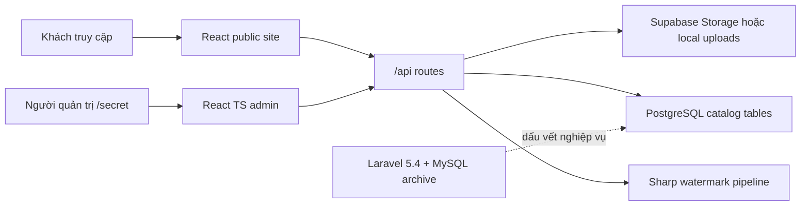

# Mini Truck CMS — Hệ thống catalog phụ tùng SINOTRUK

[Read in English](README.md)


Mini Truck CMS là hệ thống catalog và quản trị phụ tùng xe tải SINOTRUK/HOWO. Bài toán chính không chỉ là dựng vài thẻ sản phẩm; hệ thống phải làm cho hàng nghìn mã phụ tùng có thể tra cứu được, gắn mỗi phụ tùng với cả nhóm linh kiện lẫn dòng xe tương thích, bảo vệ ảnh sản phẩm bằng luồng tải watermark, và cho người vận hành nhập/sửa dữ liệu catalog mà không cần đụng mã nguồn.

Repo này đang ở trạng thái chuyển tiếp có kiểm soát. Website public là Vite React app. Admin là một React/TypeScript app riêng, mount dưới `/secret`. Upload ảnh và watermark có hai hình thái runtime: Vercel serverless function dùng Supabase Storage, và bộ Docker/Express/PostgreSQL trong `deploy/`. Phần Laravel/MySQL trong `backend/dongha.sinotruk-hanoi.com` là nguồn lịch sử/domain evidence, không phải đường chạy chính của app mới.

## Preview


Preview admin login:


## Hệ thống làm gì

- Website catalog public gồm trang chủ, danh sách sản phẩm, chi tiết sản phẩm, bài viết kỹ thuật, thư viện ảnh, giới thiệu và liên hệ.
- Tra cứu phụ tùng theo tên, mã sản phẩm, mã nhà sản xuất, nhóm phụ tùng và dòng xe.
- Admin quản lý sản phẩm, danh mục/dòng xe, bài viết, thư viện ảnh, thông tin công ty và cấu hình watermark.
- Import/export Excel cho bảo trì dữ liệu hàng loạt, có xử lý ảnh nhúng trong file import.
- Proxy ảnh và luồng tải watermark bằng `Sharp`; người dùng xem ảnh qua proxy, còn hành động tải ảnh có thể yêu cầu `?watermark=true`.
- Hai hướng triển khai: Vercel cho serverless API, hoặc Docker Compose với PostgreSQL, Express API và Nginx.

## Hình thái kỹ thuật



Public site và admin dùng chung bề mặt API catalog, nhưng tách build UI. Public giữ vai trò giới thiệu/tra cứu nhanh; admin gánh các công cụ nặng hơn như Editor.js, ExcelJS, XLSX và Recharts.

## Tech Stack

| Layer | Stack |
|---|---|
| Public frontend |      |
| Admin frontend |     |
| API và xử lý ảnh |     |
| Data và storage |    |
| Deploy |   |
| Legacy evidence |   |

## Chạy local

Website public:

```bash
npm install
npm run dev
```

Admin UI:

```bash
cd admin_ui
npm install
npm run dev
```

Docker runtime:

```bash
cd deploy
docker-compose up -d
```

Các app frontend cần API ở `/api` hoặc `VITE_API_URL`. Nếu chưa chạy API, giao diện vẫn build được nhưng danh sách sản phẩm/admin data sẽ rơi vào trạng thái rỗng hoặc lỗi tải dữ liệu.

## Đọc tiếp

- [Đặc tả kỹ thuật](docs/01-technical-specification.md)
- [Luồng sản phẩm và quản trị](docs/02-product-and-admin-workflows.md)
- [Vận hành, rủi ro và bảo trì](docs/03-operations-and-maintenance.md)
