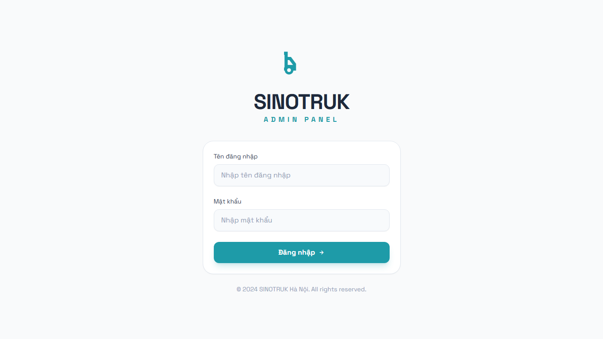
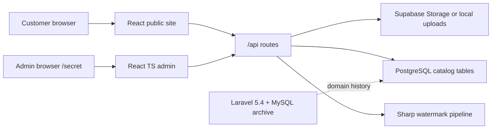

# Mini Truck CMS — SINOTRUK Parts Catalog

[Đọc bản tiếng Việt](README-vi.md)


Mini Truck CMS is a product-catalog and admin system for SINOTRUK/HOWO truck parts. Its real problem is not just showing product cards; it has to keep thousands of part codes searchable, map each part to both a part category and one or more vehicle lines, protect product images with controlled watermark downloads, and let an operator import or correct catalog data without touching source code.

The current repository is a transition system. The active public site is a Vite React app. The active admin is a separate React/TypeScript app mounted under `/secret`. Image upload and watermarking exist in two runtime shapes: Vercel serverless functions backed by Supabase Storage, and a Docker/Express/PostgreSQL runtime under `deploy/`. A Laravel/MySQL system is kept in `backend/dongha.sinotruk-hanoi.com` as historical source and domain evidence, not as the primary app path.

## Preview


Admin login preview:



## What It Does

- Public catalog site with homepage, product listing, product detail, technical article catalog, image library, about, and contact pages.
- Product search by name, product code, manufacturer code, part category, and vehicle line.
- Admin panel for product CRUD, category/vehicle-line management, article publishing, image library, company settings, and watermark settings.
- Excel import/export for bulk product maintenance, including embedded image handling in the import modal.
- Image proxy and watermark download flow using `Sharp`; normal browsing can serve clean/proxied images while protected downloads request `?watermark=true`.
- Deployment paths for Vercel and for a Docker Compose stack with PostgreSQL, Express API, and Nginx.

## Technical Shape



The public and admin apps deliberately share the catalog API surface but keep separate UI builds. The split keeps the public catalog light while the admin can carry heavier tooling such as Editor.js, ExcelJS, XLSX, and Recharts.

## Tech Stack

| Layer | Stack |
|---|---|
| Public frontend |      |
| Admin frontend |     |
| API and image processing |     |
| Data and storage |    |
| Deploy |   |
| Legacy evidence |   |

## Run Locally

Public site:

```bash
npm install
npm run dev
```

Admin UI:

```bash
cd admin_ui
npm install
npm run dev
```

Docker runtime:

```bash
cd deploy
docker-compose up -d
```

The browser apps expect an API at `/api` or `VITE_API_URL`. Without a running API, product and admin data surfaces degrade to empty/error states even if the frontend builds successfully.

## Read Next

- [Technical specification](docs/01-technical-specification.md)
- [Product and admin workflows](docs/02-product-and-admin-workflows.md)
- [Operations, risks, and maintenance](docs/03-operations-and-maintenance.md)
