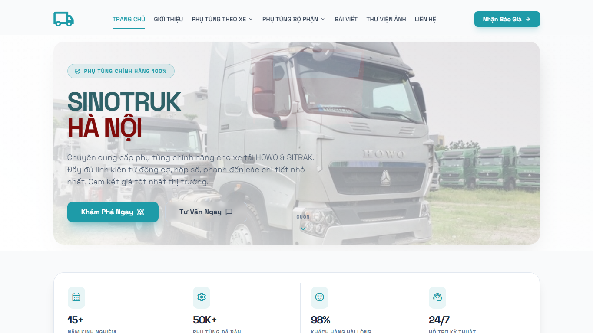
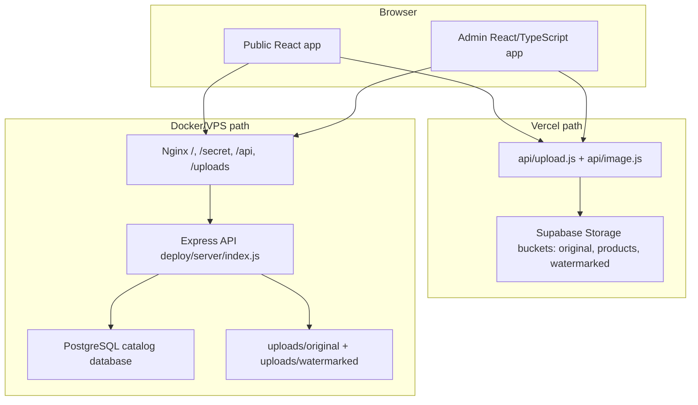
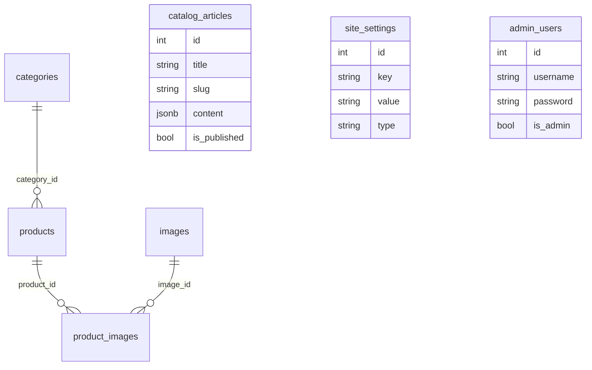

# Mini Truck CMS — Đặc tả kỹ thuật

> Mục đích: giải thích hệ thống đang chạy theo hình thái nào, vì sao nó được tách thành nhiều lớp, phần nào là hiện tại, phần nào là di sản, và các quyết định kỹ thuật cần giữ trong đầu trước khi sửa catalog, ảnh, admin hoặc deploy.

## 1. Tổng quan

Mini Truck CMS phục vụ một bài toán rất cụ thể: biến kho phụ tùng xe tải SINOTRUK/HOWO thành một catalog có thể tra cứu, có hình ảnh, có bài viết hướng dẫn và có admin vận hành được. Trong ngành phụ tùng, người mua thường không nhớ đúng tên sản phẩm; họ tra bằng mã sản phẩm, mã nhà sản xuất, nhóm linh kiện, dòng xe, hoặc ảnh. Vì vậy mô hình dữ liệu không thể chỉ là `products + categories` đơn giản.

Hệ thống hiện tại có bốn lớp quan trọng:

| Lớp | Vai trò | Trạng thái |
|---|---|---|
| Public React app | Trang chủ, sản phẩm, chi tiết, catalog bài viết, thư viện ảnh, liên hệ | Current |
| Admin React/TypeScript app | CRUD sản phẩm, danh mục, dòng xe, bài viết, ảnh, settings, import/export Excel | Current |
| API/image runtime | Vercel serverless functions hoặc Express API trong `deploy/server` | Current nhưng có hai biến thể |
| Laravel/MySQL archive | Hệ thống quản lý kho/công nợ/đơn hàng cũ, nhiều nghiệp vụ rộng hơn catalog mới | Legacy evidence |

Điểm cần hiểu: repo không phải một codebase tuyến tính. Nó là một quá trình tách catalog public/admin ra khỏi hệ thống Laravel cũ, đồng thời thử hai hướng runtime cho ảnh và API. Tài liệu vì vậy phải ghi rõ đường chạy nào đang được dùng, không gom tất cả dependency thành một “stack” duy nhất.

## 2. Current vs Legacy

| Thành phần | Bằng chứng source | Cách hiểu đúng |
|---|---|---|
| Public site | `src/App.jsx`, `src/pages/*`, `src/components/Home/*` | Đường chạy public hiện tại. |
| Admin site | `admin_ui/src/App.tsx`, `admin_ui/src/pages/*` | Đường chạy admin hiện tại, mount dưới `/secret` khi build chung. |
| Local/API abstraction | `src/services/supabase.js`, `admin_ui/src/services/supabase.ts` | Tên file còn là `supabase`, nhưng nội dung chủ yếu gọi REST API local/Vercel. Đây là compatibility layer sau khi bỏ direct Supabase query ở nhiều chỗ. |
| Vercel API | `api/upload.js`, `api/image.js`, `vercel.json` | Serverless upload/proxy/watermark dùng Supabase Storage. |
| Docker API | `deploy/server/index.js`, `deploy/docker-compose.yml`, `deploy/nginx/default.conf` | Express/PostgreSQL runtime cho deploy VPS/Docker. |
| Cloudinary | `admin_ui/src/pages/Categories.tsx`, `admin_ui/api/upload*.js` | Còn dùng cho ảnh thumbnail danh mục xe và các API upload cũ trong `admin_ui/api`. Không nên ghi Cloudinary là nơi lưu toàn bộ ảnh sản phẩm hiện tại. |
| Laravel/MySQL | `backend/dongha.sinotruk-hanoi.com`, `backend/dongha_structure.sql` | Hệ thống cũ: sản phẩm, khách hàng, nhập/xuất, báo giá, công nợ, phân quyền. Không phải app React mới. |

## 3. Kiến trúc runtime

### Tại sao có hai runtime API?

**Vercel path** hợp với deploy nhanh: `vercel.json` build cả public app và admin, sau đó rewrite `/secret/*` về admin SPA và `/api/*` về serverless function. Upload/proxy ảnh dùng Supabase Storage.

**Docker path** hợp với VPS/aaPanel: `docker-compose.yml` chạy PostgreSQL, Express API và Nginx. Nginx phục vụ static build, proxy `/api`, và expose `/uploads`. Express dùng `pg`, `multer`, `sharp` và local filesystem.

Tradeoff hiện tại là tài liệu vận hành phải chỉ rõ đang dùng path nào. Nếu cấu hình Vercel nhưng đọc hướng dẫn Docker, hoặc ngược lại, ảnh và API sẽ lỗi vì storage/database khác nhau.

## 4. Tech Stack

| Layer | Stack | Vai trò |
|---|---|---|
| Public frontend | React 18, Vite, JavaScript, React Router, GSAP, Framer Motion, React Three Fiber/Drei | Trải nghiệm catalog, animation, hero/3D, sản phẩm và bài viết. |
| Admin frontend | React 18, TypeScript, Vite, Tailwind CSS, Editor.js, Recharts, ExcelJS, XLSX | Quản trị dữ liệu, chart dashboard, soạn bài, import/export Excel. |
| Serverless API | Vercel functions, Supabase JS, Sharp | Upload base64, proxy ảnh, tạo watermark, cache watermark trong Supabase Storage. |
| Docker API | Express, `pg`, Multer, Sharp | CRUD catalog, upload local, watermark local, admin profile/login đơn giản. |
| Database | PostgreSQL schema từ `admin_ui/supabase_schema.sql`, `admin_ui/database_updates.sql`, `deploy/sinotruk_full_backup.sql` | Products, categories, images, product_images, catalog_articles, site_settings, admin_users. |
| Legacy backend | Laravel 5.4, MySQL 5.7, Maatwebsite Excel, DomPDF, Intervention Image | Hệ thống kho/bán hàng/công nợ cũ, dùng để hiểu domain và dữ liệu lịch sử. |

## 5. Domain model

### 5.1 Product không chỉ là một card

`products` là trung tâm catalog. Current schema mở rộng sản phẩm theo hướng public catalog:

- `code`: mã sản phẩm nội bộ hoặc part number hiển thị.
- `manufacturer_code`: mã nhà sản xuất, thêm sau feedback vì người dùng tra phụ tùng theo mã NSX.
- `category_id`: nhóm phụ tùng chính.
- `vehicle_ids`: mảng dòng xe tương thích, vì một phụ tùng có thể đi với nhiều dòng xe.
- `image`/`thumbnail`: ảnh đại diện legacy-compatible.
- `show_on_homepage`: quyết định sản phẩm có ra homepage hay không.

Legacy Laravel schema rộng hơn: `price`, `price_bulk`, `total`, `order_pending`, `weight`, `min`, `mansx`, log thay đổi tồn/giá. App React mới đã giảm trọng tâm kho/bán hàng, nhưng vẫn giữ dấu vết mã sản phẩm, mã NSX, ảnh và category.

### 5.2 Category vừa là nhóm phụ tùng vừa là dòng xe

Current schema dùng `categories.is_vehicle_name` để tách hai loại category:

| Loại | Dùng ở đâu | Ý nghĩa |
|---|---|---|
| Nhóm phụ tùng | Product listing, admin product form | Động cơ, phanh, hộp số, cabin... |
| Dòng xe | Vehicle showcase, product form multi-select | HOWO, SITRAK, A7, T7H, mã xe cụ thể... |

Stakeholder feedback trong repo cũ cho thấy quyết định này đến từ nhu cầu thực tế: khi thêm sản phẩm, người vận hành cần chọn đồng thời nhóm phụ tùng và dòng xe, không bị ép vào một dropdown duy nhất.

### 5.3 Image model

Ảnh có hai lớp:

- Ảnh đại diện trong `products.image`/`products.thumbnail` để giữ tương thích với UI cũ.
- Ảnh nhiều-nhiều qua `images` và `product_images`, cho phép một sản phẩm có nhiều ảnh, ảnh đầu tiên là ảnh chính.

`ProductDetail.jsx` đọc `product_images` trước; nếu không có, nó fallback về `product.image`. Đây là cách chuyển schema mà không làm gãy dữ liệu cũ.

### 5.4 Article model

`catalog_articles.content` là JSONB dạng Editor.js block. Public `Catalog.jsx` render block type `header`, `paragraph`, `list`, `checklist`, `image`. Admin `Catalogs.tsx` soạn nội dung bằng Editor.js và publish/unpublish qua `is_published`.

## 6. Technical challenges

### 6.1 Watermark không phải trang trí

Ảnh phụ tùng là tài sản bán hàng. Feedback yêu cầu ảnh public có watermark hoặc ít nhất luồng tải ảnh không đưa ảnh gốc quá dễ. Hệ thống hiện xử lý bằng proxy:

- Public image URL đi qua `/api/image`.
- Chuột phải trên ảnh proxy bị `ImageProtection.jsx` thay menu mặc định.
- Nút tải tạo URL `?watermark=true`.
- API dùng `Sharp` để composite logo hoặc fallback pattern.
- Bản watermark được cache: Supabase bucket `watermarked` trong Vercel path, hoặc `uploads/watermarked` trong Docker path.

Tradeoff: chặn chuột phải không phải DRM tuyệt đối. Nó giảm thất thoát phổ thông, còn bảo vệ thật nằm ở việc ảnh gốc không được link trực tiếp và bản tải chính thức có watermark.

### 6.2 Storage path phải thống nhất

Một số code path dùng Supabase Storage (`api/upload.js`, `api/image.js`), một số path dùng local uploads (`deploy/server/index.js`), và category thumbnail upload dùng Cloudinary unsigned preset trong `Categories.tsx`. Nếu vận hành không thống nhất, dữ liệu có thể trỏ tới ba kiểu URL khác nhau.

Quy tắc bảo trì: trước khi sửa upload/image, xác định deployment target. Vercel path cần Supabase env và buckets; Docker path cần volume uploads và PostgreSQL; Cloudinary path hiện chủ yếu nằm ở thumbnail danh mục xe.

### 6.3 Auth admin hiện còn nhẹ

Admin `ProtectedRoute` dựa vào `localStorage.isAuthenticated`. `Login.tsx` thử login qua API, nhưng có fallback credential demo `admin/admin` và `admin/123456`. Express `/api/admin/login` so sánh username/password plaintext trong `admin_users`.

Điều này phù hợp demo/nội bộ, nhưng chưa đủ cho production public admin. Nếu đưa admin lên Internet, cần bỏ demo fallback, hash password, thêm session/JWT thật, và chặn route admin ở server/proxy thay vì chỉ tin localStorage.

### 6.4 Excel import là workflow nghiệp vụ, không chỉ tiện ích

`ImportExcelModal.tsx` dùng ExcelJS để đọc sheet, lấy ảnh nhúng theo cell, map category theo ID hoặc tên, upload ảnh, rồi tạo sản phẩm. Đây là đường vận hành quan trọng vì catalog phụ tùng thường được cập nhật theo file từ kho hoặc nhà cung cấp.

Failure path cần chú ý:

- Row thiếu `code` hoặc `name` bị bỏ qua.
- Category không map được thì `category_id = null`.
- Ảnh nhúng upload lỗi thì sản phẩm vẫn có thể được tạo không ảnh.
- Không có transaction tổng thể ở frontend; import một phần có thể thành công, một phần thất bại.

### 6.5 Build/deploy split dễ gây hiểu nhầm

Root `vercel.json` chạy `npm run build:all`, build admin trước rồi copy vào `dist/secret`. Dockerfile lại build cả root app và admin bên trong image. `deploy/admin` và `deploy/client` là build artifact cũ, không phải source of truth.

## 7. API surface

### 7.1 Vercel serverless API

| Endpoint | Source | Vai trò |
|---|---|---|
| `POST /api/upload` | `api/upload.js` | Nhận base64 image, upload vào Supabase Storage bucket `original`, fallback `products`, trả proxy URL. |
| `GET /api/image` | `api/image.js` | Proxy ảnh từ Supabase Storage hoặc external URL; nếu `watermark=true`, tạo/cache bản watermark. |

### 7.2 Express/PostgreSQL API

| Nhóm | Endpoint chính | Vai trò |
|---|---|---|
| Health | `GET /api/health` | Kiểm tra API sống. |
| Upload/Image | `POST /api/upload`, `GET /api/image`, `POST /api/upload-avatar` | Upload local/base64, proxy ảnh, watermark, avatar. |
| Products | `GET/POST/PUT/DELETE /api/products`, `GET /api/products/:id` | CRUD sản phẩm, filter theo category, homepage, search, manufacturer code. |
| Categories | `GET/POST/PUT/DELETE /api/categories` | Quản lý nhóm phụ tùng và dòng xe. |
| Articles | `GET/POST/PUT/DELETE /api/catalog-articles` | Quản lý bài viết Editor.js. |
| Gallery | `GET/POST/DELETE /api/gallery-images` | Thư viện ảnh public/admin. |
| Product images | `GET /api/product-images/:productId`, `POST /api/product-images`, `DELETE /api/product-images/:id` | Liên kết nhiều ảnh với sản phẩm. |
| Admin | `POST /api/admin/login`, `GET/PUT /api/admin/profile/:userId` | Login/profile đơn giản. |
| Settings | `GET/PUT /api/site-settings` | Company info và watermark config. |

## 8. UI surface

### Public pages

| Route | Source | Vai trò |
|---|---|---|
| `/` | `src/pages/Home.jsx` | Hero, stats, vehicle showcase, video, product grid, about, categories. |
| `/products` | `src/pages/Products.jsx` | Search/filter sản phẩm, category/vehicle filter, manufacturer code filter, load more. |
| `/product/:id` | `src/pages/ProductDetail.jsx` | Chi tiết sản phẩm, carousel ảnh, mã sản phẩm/mã NSX, CTA gọi/Zalo, related products. |
| `/products/:category` | `src/pages/ProductCategory.jsx` | Trang category theo path. |
| `/catalog` | `src/pages/Catalog.jsx` | Danh sách và chi tiết bài viết Editor.js. |
| `/image-library` | `src/pages/ImageLibrary.jsx` | Gallery ảnh, lightbox, right-click watermark download. |
| `/about`, `/contact` | `src/pages/About.jsx`, `src/pages/Contact.jsx` | Giới thiệu và liên hệ. |

### Admin pages

| Route | Source | Vai trò |
|---|---|---|
| `/login` | `admin_ui/src/pages/Login.tsx` | Login API + fallback demo credential. |
| `/dashboard` | `admin_ui/src/pages/Dashboard.tsx` | Tổng sản phẩm, danh mục, bài viết, phân bổ category bằng Recharts. |
| `/products` | `admin_ui/src/pages/Products.tsx` | CRUD sản phẩm, filter, cursor-like pagination, import/export Excel, copy public link. |
| `/categories` | `admin_ui/src/pages/Categories.tsx` | Tách danh mục phụ tùng và dòng xe, thumbnail xe, visibility. |
| `/catalogs` | `admin_ui/src/pages/Catalogs.tsx` | Soạn bài bằng Editor.js, publish/unpublish. |
| `/image-library` | `admin_ui/src/pages/ImageLibrary.tsx` | Upload/xóa ảnh gallery, pagination, lightbox. |
| `/settings` | `admin_ui/src/pages/Settings.tsx` | Company info, logo, watermark text/opacity/enabled. |

## 9. Data model

Current PostgreSQL schema được gom từ `admin_ui/supabase_schema.sql`, `admin_ui/database_updates.sql`, và `deploy/sinotruk_full_backup.sql`.

Important indexes/constraints:

- `products.code` unique in base schema.
- `catalog_articles.slug` unique.
- `product_images(product_id, image_id)` unique.
- `idx_products_vehicle_ids` GIN index for `vehicle_ids`.
- `idx_products_manufacturer_code` for manufacturer-code lookup.

## 10. Legacy Laravel scope

Laravel archive includes capabilities the React catalog does not fully carry forward:

- customer management and customer payments
- imports/exports, quotes, orders, debt reports
- role and permission mapping
- product logs, stock/price/bulk price tracking
- Excel/PDF export through Maatwebsite Excel and DomPDF

This matters because some names in the new code (`Product`, `Customer`, `Order`, old `api.ts`) still reflect the old business system. Current docs should not claim the new React CMS implements the full warehouse/accounting scope unless the route is present in the new runtime.

## 11. Change safety notes

- Before changing image behavior, test both normal image view and `?watermark=true` download path.
- Before changing product schema, inspect `AddProductModal`, `EditProductModal`, `Products.jsx`, `ProductDetail.jsx`, `deploy/server/index.js`, and schema SQL together.
- Before changing category behavior, preserve the distinction between part category and vehicle category.
- Before changing deploy docs, decide whether the target is Vercel or Docker; the env/storage assumptions differ.
- Before exposing admin, remove demo auth fallback and replace plaintext password handling.
