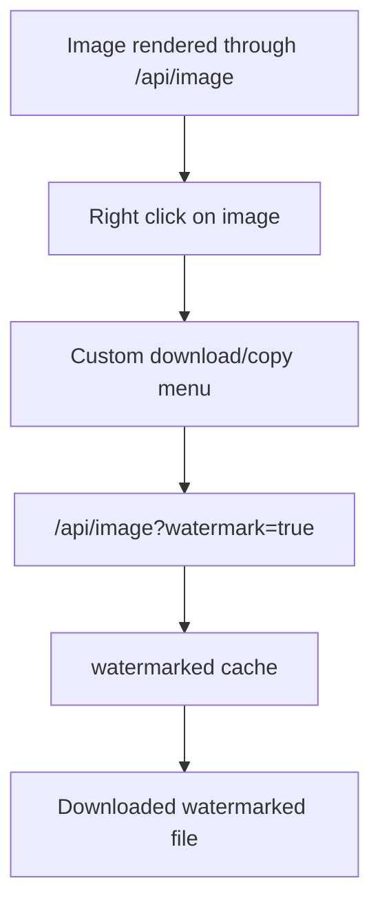
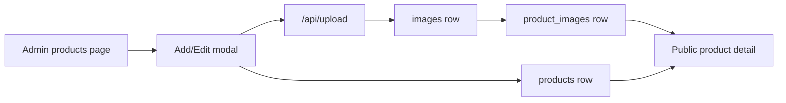
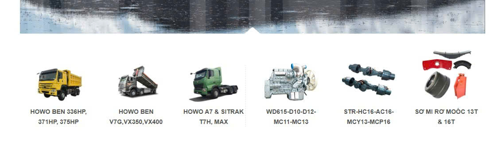

# Product and Admin Workflows

## 1. Public catalog journey

The public site is built for a buyer who may know only one fragment of the part: a product name, internal code, manufacturer code, vehicle line, or visual reference. The UI therefore presents multiple entry points instead of a single category tree.

Normal path:

1. User lands on `/`.
2. Hero and product grid establish SINOTRUK/HOWO context.
3. Vehicle showcase links into product filtering by vehicle line.
4. `/products` lets the user filter by part category, vehicle category, name/code, or manufacturer code.
5. `/product/:id` shows image carousel, product code, manufacturer code, description, related products, and contact CTA.

Failure path:

- If API is unavailable, homepage/product pages can fall back to placeholder or empty states in some components.
- If product detail cannot load a product, `ProductDetail.jsx` redirects back to `/products`.
- If product image fails, the `img` element hides itself or falls back to a placeholder icon.

## 2. Product filtering

`Products.jsx` has three filter dimensions:

| Dimension | Data field | Why it exists |
|---|---|---|
| Part category | `category_id` | Buyer knows the mechanical group: engine, brake, cabin, gearbox... |
| Vehicle line | `vehicle_ids` | Buyer knows the truck model first, then finds compatible parts. |
| Manufacturer code | `manufacturer_code` | Spare-parts lookup often starts from OEM/manufacturer code rather than display name. |

Current caution: the public `VehicleShowcase` links with `?vehicle=<id>`, while `Products.jsx` currently reads `category` from the URL. That mismatch should be checked before relying on vehicle deep links in production.

## 3. Product detail and multi-image handling

`ProductDetail.jsx` resolves product images in this order:

1. Query `product_images/:productId`.
2. If found, use the linked image list as carousel images.
3. If empty, fallback to `product.image`.
4. If no image exists, show a neutral placeholder.

This migration pattern allows old single-image products and newer multi-image products to coexist.

## 4. Image protection workflow

Normal path:

- Image URLs are normalized by `getImageUrl`.
- `ImageProtection.jsx` intercepts right click on images served through `/api/image`.
- The custom download action requests `watermark=true`.
- The API composites logo/watermark and caches the result.

Failure path:

- If logo fetch fails, Vercel `api/image.js` falls back to diagonal SVG pattern.
- If the original image is not found, API returns `404`.
- If the image is an external URL, the proxy fetch can fail independently of the catalog database.

## 5. Admin login

Current admin auth is intentionally light:

- `ProtectedRoute` checks `localStorage.isAuthenticated`.
- `Login.tsx` calls API login first.
- If API login fails, demo credentials `admin/admin` and `admin/123456` can still authenticate.
- Express login checks plaintext username/password in `admin_users`.

This is acceptable for local/demo operation only. Production hardening must remove fallback credentials, hash passwords, and enforce server-side authorization.

## 6. Admin product maintenance

Normal create path:

1. Admin opens `AddProductModal`.
2. Enters product code, name, manufacturer code, part category, vehicle lines, description, homepage visibility.
3. Uploads one or more images.
4. UI creates product first.
5. UI creates image records and links them through `product_images`.
6. First image becomes the representative image.

Failure path:

- Missing product code or name blocks submit in UI.
- Upload failure leaves image out of the product payload.
- Product creation and image linking are not wrapped in a single backend transaction from the UI side. If linking fails after product creation, the product may exist without the intended gallery.

## 7. Excel import

Excel import is a first-class catalog maintenance path, not a convenience script.

`ImportExcelModal.tsx` expects columns for:

- product code
- product name
- manufacturer code
- category
- image
- description
- homepage visibility

It also creates a template workbook with a second sheet listing current categories. During import, it reads embedded images from the worksheet, converts them to base64, uploads them through `/api/upload`, and creates products row by row.

Operational implications:

- Import is partial-success. Rows can fail while earlier rows remain created.
- Category matching accepts ID or exact category name.
- Embedded image upload is best-effort; failed image upload does not necessarily abort the whole file.
- A future safer version should send parsed rows to a backend import endpoint so validation, transaction boundaries, and import reports live server-side.

## 8. Category and vehicle-line workflow

`Categories.tsx` separates:

- `type = part`: regular part category
- `type = vehicle`: vehicle line shown on homepage and usable in product compatibility

Vehicle categories require thumbnail upload because they are visual homepage entities. The current upload path for category thumbnails uses Cloudinary unsigned upload preset (`sinotruk_unsigned`) and cloud name `dxggvypzl`.

Risk: Cloudinary is active in this one admin path while product images may use `/api/upload`. If image providers are consolidated later, category thumbnails must be migrated too.

## 9. Article workflow

Admin article flow:

1. `Catalogs.tsx` opens Editor.js.
2. Admin writes title, optional slug, and block content.
3. Save creates or updates `catalog_articles`.
4. Publish toggle changes `is_published`.
5. Public `Catalog.jsx` lists articles and renders selected article blocks.

Failure path:

- Slug generation strips Vietnamese diacritics in a simple browser-side transform.
- Image upload in Editor.js posts to `/api/upload`.
- Public rendering supports a limited set of block types; unsupported blocks are ignored.

## 10. Gallery workflow

Admin `ImageLibrary.tsx` uploads images, stores rows in `gallery_images`, and lets the operator delete rows. Public `ImageLibrary.jsx` displays paginated gallery images, opens a lightbox, and reuses the watermark download context-menu pattern.

The gallery should be treated as marketing/catalog media, separate from product-specific image galleries.
